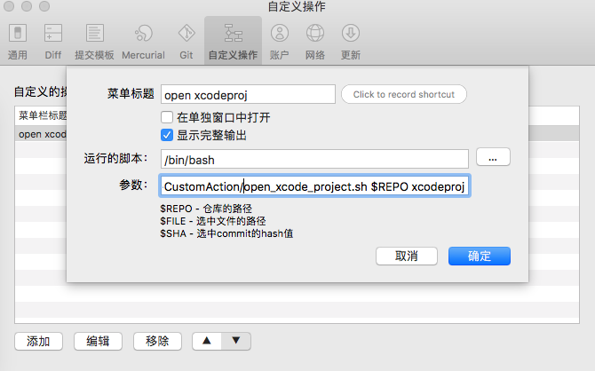

SourceTree自定义操作脚本库
## 实现打开项目项目文件
支持打开两种格式文件：xcodeproj 和 xcworkspace

## 推送Pod索引私库
自动检索本地目录中的`.podspec`私有索引文件，然后发布到指定的私库中去。
暂时仅支持[个人私库中](https://github.com/huos3203/PodRepo.git)。

[详情](pushPodSpec.sh)

配置如图：



# SourceTree Custom Actions
[摘自](https://github.com/huos3203/sourcetree-custom-actions-scripts/blob/master/README.md)

用在SourceTree自定义操作的命令集

## 安装

进入 `$HOME/Library/Application Support/SourceTree/`:

```shell
cd "$HOME/Library/Application Support/SourceTree/"
```

在该目录下clone (or download)该命令集库: 

```shell
git clone \
    https://github.com/rogeriopradoj/sourcetree-custom-actions-scripts.git \
    scripts
```

然后, 移步到SourceTree, `Preferences -> Custom Actions -> Add`, 填写如下选项:

- **Menu Caption**: 命令菜单的名称;
- **[x] Show Full Ouput**: 选中，方便查看命令执行日志;
- **Script to run**: 指向 `$HOME/Library/Application Support/SourceTree/scripts` 目录选择执行文件.sh;

至此完成了一个命令配置。   
注意：如果想使用自定义操作，就要对自脚本文件进行上述配置步骤。


### 脚本更新


可以通过下载最新包，也可以执行如下命令：

```shell
CWD=`pwd` && \
    cd "$HOME/Library/Application Support/SourceTree/scripts" && \
    git pull && \
    cd $CWD
```
至此就完成脚本更新


## 使用

当在打开一个库工作时，就可以通过菜单`Actions -> Custom Actions`来选择之前定义的操作。

### 扩展 - 集成式开发环境中使用 Usage via CLI

把`$HOME/Library/Application Support/SourceTree/scripts`目录添加到系统环境变量`$PATH`中。这样，就可以在CLI中直接调用脚本名称，而不用对每个脚本进行全路径的配置了。

#### 安装到两种shell

当使用的是`bash` 命令时:

```shell
echo \
    'export PATH=$PATH:"$HOME/Library/Application Support/SourceTree/scripts/"' \
    >> ~/.bashrc && \
    source ~/.bashrc
```

当使用的是`zsh`命令时:

```shell
echo \
    'export PATH=$PATH:"$HOME/Library/Application Support/SourceTree/scripts/"' \
    >> ~/.zshrc && \
    source ~/.zshrc
```

配置换环境变量之后，直接调用命令行`git-push-master-to-all-remotes`，如下：

```shell
cd PATH_TO_ANY_GIT_PROJECT
git-push-master-to-all-remotes
```
